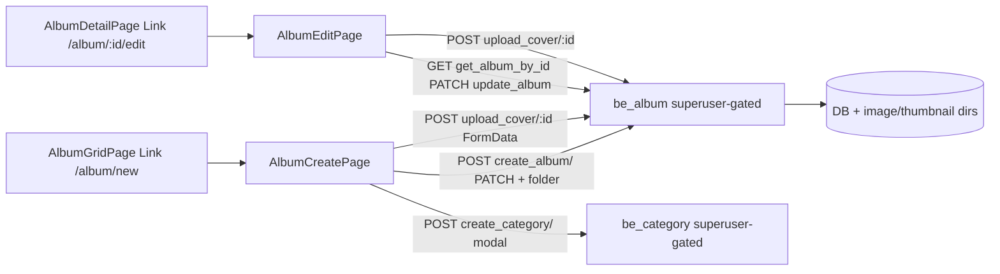

<!-- markdownlint-disable-file -->
# Task Research: AlbumsAventures Jinja FULL Decommission (Option B — SPA-native album create/edit)

Complete the Jinja2 decommission started in turn 16 (SAFE PARTIAL). The user chose **Option B**:
build SPA-native album **create** (`/app/album/new`) and **edit** (`/app/album/:id/edit`) so the last
two Jinja pages (`album_form.html`, `album_edit.html`) and `base.html` can be removed, `fe_router.py`
deleted, and Jinja fully dropped: remove `jinja2` dependency, collapse CSP to a single hardened policy,
and remove `utils/csrf.py` if orphaned.

RESEARCH ONLY — no code was modified.

> Note on method: the Task Researcher subagent tools (`runSubagent`/`task`) were not available in this
> session, so investigation was performed directly with read-only workspace tools. All findings below
> are backed by exact file/line evidence.

## Task Implementation Requests

* Replicate `album_form.html` (create) + `album_edit.html` (edit) as SPA-native React pages with full field parity.
* Point the SPA at the real backend create/update endpoints directly (retire the fe_router httpx loopback).
* Remove the last 2 templates + `base.html`, delete `fe_router.py` (relocating `/category/create` + `/rando`), drop `jinja2`, collapse CSP, remove `utils/csrf.py`.

## Scope and Success Criteria

* Scope: field-level parity contract for create+edit; backend endpoints + authz to call; SPA files/routes to add/change; fe_router leftover disposition; final CSP shape; orphan-check (jinja2, csrf). Excludes: writing code, PWA/Phase 4, upload/TUS reliability.
* Assumptions:
  * The SPA is served same-origin under `/app` (`configure_spa`), so all `/be_*` calls are same-origin.
  * `Album_Category` (create/edit read shape) already flows through the SPA via `types/api.ts`.
  * Cover-image parity is required for a FULL decommission (the Jinja forms accept a cover file).
* Success Criteria:
  * A React create page and edit page exist under `/app` reproducing every Jinja field + validation + the category-create modal + cover drag/drop preview.
  * The SPA calls `POST /be_album/create_album/` and `PATCH /be_album/update_album/{id}` directly (no fe_router hop), with a cover-upload path decided.
  * `frontend/templates/` and `frontend/routers/fe_router.py` are deletable; `jinja2` has zero importers; `utils/csrf.py` has zero importers; CSP is a single hardened policy; `TestSecurityHeaders` updated.

## Outline

1. Field-level parity contract (create + edit) — the React form spec.
2. Backend create/update endpoints + authz (and the two authorization gaps).
3. Cover-image handling gap (no backend multipart endpoint today).
4. Existing SPA patterns to reuse (apiClient, routes, mutation form template) + exact link changes.
5. CSRF/SameSite posture → is removing `utils/csrf.py` safe.
6. fe_router leftover disposition (`/category/create`, `/rando`).
7. Full CSP collapse scope + test changes.
8. Dependency + orphan check (jinja2, csrf, spa_serving independence).
9. Open questions to surface (not resolved).

## Potential Next Research

* Exact `be_category/create_category/` + `be_group/*` superuser-gating status (mirror of the create_album gap).
  * Reasoning: SPA category-create modal calls `create_category` directly; same authz regression risk as `create_album`.
  * Reference: backend/routers/be_category.py L9, L36.
* `folder.rename_album_folder` / `folder.create_album_folder` behavior when a cover changes category/title (dir move) for the SPA edit path.
  * Reasoning: edit warns that changing category/title/date/participants renames dirs; SPA must preserve this backend-driven behavior.
  * Reference: backend/routers/be_album.py L128-L155; frontend/templates/album_edit.html L21-L38.

## Research Executed

### File Analysis

* frontend/templates/album_form.html
  * Create form: `action="/album/new"`, `method="POST"`, `enctype="multipart/form-data"` (L34-L40). Hidden `csrf_token` (L41). Fields: `title` text required maxlength=50 (L50-L58); `description` textarea optional (L64-L72); `category_id` select required + "+ create category" modal button (L82-L113); `date` type=date required, default = today (L122-L131, JS L358); `participants` text optional maxlength=512 (L140-L149); `location` text optional maxlength=512 (L157-L166); `tags` text optional maxlength=512 (L174-L182); `image_cover` type=file accept=image/* optional, drag/drop + preview (L190-L233). Submit disables + spinner (L238-L261). Alpine `albumForm()` state incl. category-create modal 2-step confirm calling `POST /category/create` (L340-L440).
* frontend/templates/album_edit.html
  * Edit form: `action="/album/{album_id}/edit"`, POST multipart (L66-L72). Hidden `csrf_token` (L70). Same fields as create but pre-filled via `value="{{ album.* }}"`; `participants`/`tags` pre-joined to comma form via `participants_web`/`tags_web` (L145, L163). Category select marks current with `selected` (L112-L118). Cover is optional "new image replaces current"; current cover previewed if `album.image_cover_url` (L54-L67). NO category-create modal (simpler Alpine `albumEditForm()`, L300-L340). Warning banner: changing category/title/date/participants renames image dirs (L21-L38).
* frontend/routers/fe_router.py
  * `GET/POST /album/new` (L118-L330) + `GET/POST /album/{album_id}/edit` (L336-L520) — superuser-gated (`require_superuser`, L128 etc.), CSRF-validated, then httpx→backend loopback. Create flow: `POST {album_url}/create_album/` → `GET .../get_album_by_id/{id}` → `GET .../create_album_folder/{id}` → link to group `default_group_name` ("Tous les Albums") → `_save_cover_image` + PATCH image_cover → redirect `/admin/groups` (L228-L300). Edit flow: `PATCH .../update_album/{id}` → optional cover save → redirect `/album/{id}` (L444-L510). Residual non-create/edit routes: `POST /category/create` (L45-L100, superuser+CSRF AJAX), `GET /rando` (L516-L519, 302 to static). Jinja-only helpers: `_get_categories` (L523), `_get_album_folder_path` (L544), `_save_cover_image` (L563-L620). Jinja binding: L8 `Jinja2Templates` import, L21 `templates = Jinja2Templates(directory="frontend/templates")`.
* backend/routers/be_album.py
  * `router = APIRouter(prefix="/be_album", dependencies=[Depends(get_current_user)])` (L26) — AUTH-only, NOT superuser. `POST /create_album/` body `schemas.AlbumCreate` → `crud.create_album` + auto-links group `"all_albums"` (L112-L124). `PATCH /update_album/{album_id}` body `schemas.AlbumUpdate` → updates + `folder.rename_album_folder` (L128-L155). `GET /create_album_folder/{album_id}` (L158-L165). `GET /get_album_by_id/{album_id}` → `Album_Category` (L101-L106). No `UploadFile`/cover endpoint anywhere in the router.
* backend/db/schemas.py
  * `AlbumBase` (L82-L90): `title` (min1 max50), `description` opt, `category_id` int, `date`, `participants`/`location`/`tags`/`image_cover` (opt, max512). `AlbumCreate(AlbumBase)` (L93). `AlbumUpdate(BaseModel)` (L123-L132): ALL fields optional (partial PATCH). `Album_Category` adds `category` (L104-L109).
* frontend/spa/src/lib/apiClient.ts
  * Same-origin typed client. `credentials: "same-origin"`. On POST/PUT/PATCH/DELETE injects `X-CSRF-Token` read from JS-readable `csrf_token` cookie via `parseCsrfToken(document.cookie)` (L20, L58-L83). If cookie absent, `csrfHeader()` returns `{}` (L58-L61). 401 → `UnauthorizedError`. `api.post/patch/put/del` helpers (L111-L133) JSON only — no multipart helper.
* frontend/spa/src/App.tsx
  * React Router table. No `/album/new` or `/album/:id/edit` route. Superuser routes wrap `<RequireSuperuser>` (e.g. `/admin`, L92-L103). `*` → `Navigate to="/"` (L128).
* frontend/spa/src/pages/AlbumGridPage.tsx
  * Outbound link to change: `<a href="/album/new">` gated on `user?.is_superuser` (L143-L150).
* frontend/spa/src/pages/AlbumDetailPage.tsx
  * Outbound link to change: `<a href={`/album/${album.id}/edit`}>` gated on `isSuperuser` (L174-L181). Uses `useMutation` (L60-L61) `api.post(`/be_resizer/create_thumbnails/${albumId}`)`.
* frontend/spa/src/pages/AdminPage.tsx
  * Reusable form + mutation template: `createGroup = useMutation({ mutationFn: (body) => api.post<Group>("/be_group/create_group/", body) })` (L228-L230); `submitCreate` calls `.mutate` (L288-L289); `<form onSubmit={submitCreate}>` with controlled inputs + `disabled={createGroup.isPending}` (L341-L371).
* utils/security.py
  * Two CSP policies. `_CSP_SHARED` (L83-L110) surface-independent directives. `_CDN_TAILWIND` (L74), `_CDN_UNPKG` (L75) constants. `_CSP_DIRECTIVES_JINJA` (L120-L124): `script-src 'self' 'unsafe-inline' tailwind unpkg`; `style-src` same. `_CSP_DIRECTIVES_SPA` (L127-L135): `script-src 'self'`; `style-src 'self' 'unsafe-inline'`. `_MEDIA_CSP` sandbox (L140). Middleware `SecurityHeadersMiddleware.dispatch` selects Jinja-vs-SPA by path (`_SPA_PATH_PREFIX = "/app"`, L79).
* utils/csrf.py
  * Double-submit helpers: `generate_csrf_token`, `get_csrf_token`, `set_csrf_cookie` (cookie `csrf_token`, httponly=False, samesite=strict, L44-L57), `validate_csrf_token`, `require_csrf`. `CSRF_COOKIE_NAME = "csrf_token"` (L21).
* utils/config.py
  * `backend_api` (L213-L235): `base_url` = `BACKEND_BASE_URL` (default `http://localhost:8003`); `album_url = {base}/be_album`; `category_url = {base}/be_category`; `group_url = {base}/be_group`; `default_group_name = "Tous les Albums"`.
* AlbumsAventures-BE.py / AlbumsAventures_BE_test.py
  * Registration order (fe_router slot): `be_media_bridge.router` → `fe_router.router` → `fe_redirects.router` → mounts → `configure_spa(app)` LAST (BE.py L130-L148; test L64-L75).
* tests/test_auth.py::TestSecurityHeaders (L373-L455)
  * `test_jinja_csp_cdn_allowances_are_host_pinned` (L411) asserts on `/be_auth/me`: tailwind + unpkg PRESENT, transloadit ABSENT, `'unsafe-inline'` PRESENT. `test_spa_csp_is_tightened_same_origin_only` (L431) asserts on `/app`: `script-src == "script-src 'self'"`, no CDN, no unsafe-inline/eval.

### Code Search Results

* `UploadFile|File(` in backend/**/*.py
  * Zero cover-upload/multipart endpoints. Only `image_cover` DB/schema references (be_album.py, crud.py). Cover bytes are written ONLY by fe_router `_save_cover_image` (direct disk write + PIL thumbnail).
* `csrf_token|validate_csrf|set_csrf_cookie` across repo
  * The `csrf_token` cookie is SET only by `utils/csrf.py::set_csrf_cookie`, called only from fe_router page GETs. NO `be_*` endpoint sets or validates it. Change records confirm: "the app has no header-validating CSRF middleware; JSON-endpoint CSRF defense is the SameSite auth cookie + non-GET method" (changes/2026-07-07/...increment5-changes.md L55).
* `jinja` in requirements.txt / pyproject.toml
  * `requirements.txt` L16 `jinja2`. `pyproject.toml` L4 only mentions "Jinja2" in the description string (cosmetic).
* `Jinja2Templates` importers
  * Only `frontend/routers/fe_router.py` L8/L21. No test imports Jinja2Templates or reads `album_form.html`/`album_edit.html`/`base.html` (the obsolete `album_upload.html` contract test was already removed in turn 16).
* `require_superuser` (server-side page guard)
  * Lives in `utils/auth.py`, used only by fe_router pages. Backend RBAC uses a separate `@require_superuser_gate` decorator in `be_auth.py` (applied to `be_group` (all 13) + `be_resizer.create_thumbnails`), NOT to `be_album` create/update.

### External Research

* None required — this is an internal-decommission task grounded entirely in workspace evidence.

### Project Conventions

* Standards referenced: strangler-migration invariants (no CSP/CORS loosening); cookie-only auth + `X-CSRF-Token` echo; `@require_superuser_gate` server-side RBAC pattern (be_auth.py).
* Instructions followed: `.github/instructions/hve-core-location.instructions.md`; repo research conventions (`.copilot-tracking/research/{date}/`); plain-text workspace-relative paths for AI-consumed tracking files.

## Key Discoveries

### 1. Field-level parity contract (create + edit)

Both forms POST `multipart/form-data` today; the React versions send JSON to `/be_album/*` plus a separate cover upload. Field contract (identical field set for create and edit):

| Field | HTML type | Required | Constraints | Create default | Edit prefill | Backend key |
|-------|-----------|----------|-------------|----------------|--------------|-------------|
| `title` | text | Yes | maxlength 50, min 1 (schema) | empty | `album.title` | `title` |
| `description` | textarea | No | none | empty | `album.description or ''` | `description` (→ `null` if empty) |
| `category_id` | select | Yes | must be an existing category id | none (disabled placeholder) | `album.category_id` selected | `category_id` (int) |
| `date` | date | Yes | ISO `YYYY-MM-DD` | today (`new Date().toISOString().split('T')[0]`) | `album.date` | `date` |
| `participants` | text | No | maxlength 512; UI comma/`\|` separated | empty | `participants_web` (DB `\|` → `, `) | `participants` (Web→DB: join with `\|`, `null` if empty) |
| `location` | text | No | maxlength 512 | empty | `album.location or ''` | `location` (→ `null` if empty) |
| `tags` | text | No | maxlength 512; comma separated | empty | `tags_web` (DB `\|` → `, `) | `tags` (Web→DB: join with `\|`, `null` if empty) |
| `image_cover` | file | No (optional both) | `accept=image/*`, "≤10MB" copy | none | current cover previewed (`album.image_cover_url`) | filename stored in `image_cover`; bytes need a cover-upload path |

Parity behaviors to reproduce:

* **participants/tags transform** — Web comma form ↔ DB pipe (`|`) form. Edit read: `", ".join(p.strip() for p in db.split("|") if p.strip())` (fe_router L468-L470). Write: `"|".join(p.strip() for p in web.split(",") if p.strip())` (fe_router L438-L440). The SPA must do this transform client-side (or a helper in `lib/`).
* **Category-create modal (create only)** — 2-step (name entry min 3 / max 128 → confirm) calling `POST /category/create` (Alpine `createCategory`, album_form.html L340-L440). React version calls `POST /be_category/create_category/` directly (see gaps below), then appends the new option and selects it.
* **Cover drag/drop + preview** — FileReader dataURL preview, remove button, drag-over highlight (album_form.html L340-L400). Pure UI; reproduce with React state + `<input type=file>`.
* **Submit spinner + disable** — `submitting` state (both forms). Map to `mutation.isPending`.
* **Edit warning banner** — dir-rename caution (album_edit.html L21-L38); render as static copy.
* **Redirects** — create → `/admin/groups` (now `/app/admin`); edit → `/album/{id}` (now `/app/albums/{id}`). React uses `useNavigate`.

### 2. Backend create/update endpoints + authz (TWO gaps)

* Create: `POST /be_album/create_album/` — body `schemas.AlbumCreate` (all `AlbumBase` fields; `image_cover` optional). Returns `schemas.Album`. Auto-links the new album to the group named `"all_albums"` server-side (be_album.py L116-L119). Post-create the SPA should also call `GET /be_album/create_album_folder/{id}` (folder scaffold, as fe_router does).
* Update: `PATCH /be_album/update_album/{album_id}` — body `schemas.AlbumUpdate` (all optional). Returns `schemas.Album`. Renames/moves image dirs via `folder.rename_album_folder` when category/title/date/participants change (be_album.py L128-L155) — this is why the edit warning exists; behavior is preserved automatically by calling the same endpoint.
* Read for edit prefill: `GET /be_album/get_album_by_id/{id}` → `Album_Category`.

**Gap A — authorization regression risk (CRITICAL).** `be_album` is gated by `Depends(get_current_user)` only (be_album.py L26) — ANY authenticated user can hit `create_album`/`update_album`. The Jinja routes enforced `require_superuser` (fe_router L128 etc.). If the SPA calls these directly with only a client-side `RequireSuperuser` guard, non-admins could create/update albums via crafted requests. Recommended fix (mirrors the FU-group hardening): apply `@require_superuser_gate` (be_auth.py) to `create_album`, `update_album`, and `create_album_folder`. Client-side `RequireSuperuser` remains a UX gate only.

**Gap B — group-name divergence (behavioral, low risk).** Backend `create_album` auto-links to group `"all_albums"` (be_album.py L116), while fe_router additionally linked to `default_group_name = "Tous les Albums"` (config.py L235; fe_router L246-L270). These are different names. Decide the canonical group; the SPA should NOT replicate the redundant "Tous les Albums" link unless it is intentional (surface to architect).

### 3. Cover-image handling gap (biggest structural gap)

There is **no backend endpoint that accepts a cover-image file**. Today fe_router's `_save_cover_image` (L563-L620) writes the file to `images/{cat}/{date}_{title}_{participants}/{filename}` + generates a PIL thumbnail into `thumbnails/...`, using `_get_album_folder_path` (L544). Because both Jinja forms treat the cover as **optional**, two options exist:

* **Option 3a (full parity, recommended for Option B):** add a backend endpoint `POST /be_album/upload_cover/{album_id}` accepting `UploadFile`, moving `_save_cover_image` + `_get_album_folder_path` logic server-side (superuser-gated), then PATCH `image_cover=filename`. The React page uploads via `FormData` (needs a small multipart helper alongside `apiClient`, since `api.post` is JSON-only). This lets `fe_router.py` be fully deleted.
* **Option 3b (MVP):** ship SPA create/edit WITHOUT cover upload first (create empty, set cover later). But this drops a working feature and does NOT achieve full parity — only acceptable if the user accepts a temporary regression. Given Option B's "FULL decommission" intent, 3a is the parity-correct path.

### 4. Existing SPA patterns to reuse + exact link changes

* API client: `frontend/spa/src/lib/apiClient.ts` — `api.post<T>(path, body)` / `api.patch<T>(path, body)` (JSON). For the cover file, add a `postForm`/`upload` helper using `FormData` + `credentials: "same-origin"` (no `Content-Type` so the browser sets the multipart boundary; still injects `X-CSRF-Token` for consistency).
* Mutation form template: `AdminPage.tsx` GroupsPanel (`createGroup` useMutation + `submitCreate` + controlled `<form>`, L228-L371) is the closest pattern to copy.
* Route table: add to `App.tsx` two routes wrapped in `<RequireAuth><RequireSuperuser>` (mirroring `/admin`, L92-L103):
  * `path="/album/new"` → `AlbumCreatePage`
  * `path="/album/:albumId/edit"` → `AlbumEditPage`
  * **SPA path convention:** routes are basename-relative to `/app` (grid `/` = `/app/`, detail `/albums/:id` = `/app/albums/:id`). So the browser URLs become `/app/album/new` and `/app/album/:id/edit`. (Note the existing detail route uses `/albums/:id` plural; create/edit here use singular `/album/...` to match the redirect shims and the outbound links — confirm naming with the implementer; the redirect shim maps bare `/album/new` → `/app/album/new`.)
* Exact outbound link changes:
  * `AlbumGridPage.tsx` L144 `<a href="/album/new">` → `<Link to="/album/new">` (React Router, basename `/app`).
  * `AlbumDetailPage.tsx` L176 `<a href={`/album/${album.id}/edit`}>` → `<Link to={`/album/${album.id}/edit`}>`.
* Session/superuser: `useSession` exposes `user.is_superuser`; `RequireSuperuser` already redirects non-admins (used by `/admin`).

### 5. CSRF / SameSite — removing `utils/csrf.py` is SAFE

* No `/be_*` endpoint validates `X-CSRF-Token` or the `csrf_token` cookie. The real CSRF defense is the SameSite auth cookie (`access_token`, samesite configurable — research notes `lax`) + non-GET method. The apiClient's `X-CSRF-Token` echo is belt-and-suspenders scaffolding.
* The `csrf_token` cookie is set ONLY by fe_router (via `set_csrf_cookie`). After fe_router is deleted, the cookie is simply never set; `csrfHeader()` returns `{}` and mutations still succeed (server ignores the header). Therefore `utils/csrf.py` becomes orphaned and is safe to delete.
* The apiClient CSRF scaffolding can stay (harmless dead code) or be removed later; not required for decommission. **No new CSRF middleware is needed** — this matches the established app pattern.

### 6. fe_router leftover disposition (`/category/create`, `/rando`)

After create/edit routes are removed, `fe_router.py` still holds two non-Jinja routes that must survive so the file + `Jinja2Templates` can be deleted:

* `POST /category/create` (fe_router L45-L100): superuser + CSRF AJAX wrapper around `POST {category_url}/create_category/`. **Consumer:** the Jinja `album_form.html` category modal ONLY (album_form.html L430). Since the React create page will call `POST /be_category/create_category/` directly, `/category/create` can be **deleted entirely** — provided `be_category.create_category` is superuser-gated (currently AUTH-only, be_category.py L9/L36 → same Gap A; recommend `@require_superuser_gate`).
* `GET /rando` (fe_router L516-L519): 302 redirect to `/static/rando/propositions-rando.html`. Not Jinja. **Disposition:** move this one-line redirect into `frontend/routers/fe_redirects.py` (the existing 302-shim router) so no Jinja-bound file remains. Any external `/rando` link keeps working.

Helpers `_get_categories`, `_get_album_folder_path`, `_save_cover_image` are deleted with fe_router; `_save_cover_image` + `_get_album_folder_path` logic MOVES to the backend cover endpoint (Option 3a).

Result: `frontend/routers/fe_router.py` and `frontend/templates/` (all remaining: `base.html`, `album_form.html`, `album_edit.html`) are deleted. Registration in `AlbumsAventures-BE.py` L47/L132 and `AlbumsAventures_BE_test.py` L28/L65 drops the `fe_router` import + `include_router(fe_router.router)` line; `be_media_bridge` + `fe_redirects` + `configure_spa` (LAST) remain.

### 7. Full CSP collapse scope + test changes

Once `base.html`/`album_form.html`/`album_edit.html` are gone, no live page needs Tailwind CDN, unpkg/Alpine CDN, or inline `<script>`. Delete from `utils/security.py`:

* Constants `_CDN_TAILWIND` (L74), `_CDN_UNPKG` (L75).
* The entire `_CSP_DIRECTIVES_JINJA` dict (L120-L124).
* The middleware branch that selects Jinja-vs-SPA by path — collapse to a single policy (the current SPA policy) for all non-media surfaces. `_SPA_PATH_PREFIX` (L79) is no longer needed for branching.

**Final single hardened CSP** (= current `_CSP_DIRECTIVES_SPA`, applied everywhere except media mounts):

```text
default-src 'self'; img-src 'self' data: blob:; media-src 'self' blob:; font-src 'self' data:;
connect-src 'self'; worker-src 'self' blob:; manifest-src 'self'; object-src 'none'; base-uri 'self';
form-action 'self'; frame-ancestors 'none'; script-src 'self'; style-src 'self' 'unsafe-inline'
[; upgrade-insecure-requests  (prod only)]
```

* `script-src 'self'` — no CDN, no inline, no eval.
* `style-src 'self' 'unsafe-inline'` — **residual `'unsafe-inline'` KEPT** for runtime-injected styles (e.g. Uppy); tracked separately (hash/nonce follow-up). This is the only remaining relaxation.
* `_MEDIA_CSP` (sandbox, L140) is **unchanged** for `/images`,`/thumbnails`.

**Test changes in `tests/test_auth.py::TestSecurityHeaders`:**

* `test_jinja_csp_cdn_allowances_are_host_pinned` (L411-L429) — **DELETE or invert.** It asserts tailwind + unpkg PRESENT and `'unsafe-inline'` PRESENT on `/be_auth/me`. After collapse, `/be_auth/me` returns the hardened policy → these assertions FAIL. Replace with assertions that tailwind/unpkg are ABSENT everywhere and `script-src` has no `'unsafe-inline'`.
* `test_spa_csp_is_tightened_same_origin_only` (L431-L455) — keep; it now describes the single policy. Optionally broaden it to also check a non-`/app` route (e.g. `/be_auth/me`) now returns the same hardened `script-src 'self'`.
* `test_security_headers_present_on_response` (L382) + `test_csp_never_allows_unsafe_eval_or_wildcard` (L397) hit `/be_auth/me` and stay green (they assert only shared/hardened invariants).
* Land the CSP collapse and the test inversion in the SAME commit (per security condition in decisions.md).

### 8. Dependency + orphan check

* `jinja2`: only importer is `frontend/routers/fe_router.py` (L8 `Jinja2Templates`). After fe_router deletion → zero importers. Remove `jinja2` from `requirements.txt` L16. `pyproject.toml` L4 description string mention is cosmetic (optional cleanup). No test imports Jinja2Templates.
* `utils/csrf.py`: only importer is `frontend/routers/fe_router.py` (L26). After fe_router deletion → zero importers → delete `utils/csrf.py`. (SPA CSRF is SameSite-cookie based; server never validated the token — Section 5.)
* `frontend/spa_serving.py` / `configure_spa`: Jinja-independent (mounts SPA static assets; must remain registered LAST). No `Jinja2Templates` usage. Safe to keep as-is.
* `require_superuser` (utils/auth.py): used only by fe_router pages; becomes orphaned after fe_router deletion (verify no other importer before removing — backend RBAC uses `require_superuser_gate`, a different symbol).

## Technical Scenarios

### Scenario: SPA-native album create + edit with server-side authz and cover upload (selected)

Build `AlbumCreatePage.tsx` + `AlbumEditPage.tsx` under `/app`, calling `/be_album/*` directly; add a superuser-gated backend cover-upload endpoint so the last templates + `fe_router.py` + `jinja2` + `utils/csrf.py` can all be removed and CSP collapsed to one hardened policy.

**Requirements:**

* Field parity per Section 1 (incl. participants/tags pipe transform, category-create modal on create, cover drag/drop preview, edit prefill + current-cover preview).
* Direct `POST /be_album/create_album/` + `GET /be_album/create_album_folder/{id}` + `PATCH /be_album/update_album/{id}`; edit read via `GET /be_album/get_album_by_id/{id}`.
* Server-side superuser gating on `create_album`, `update_album`, `create_album_folder`, `create_category`, and the new cover endpoint (`@require_superuser_gate`).
* Cover upload via new `POST /be_album/upload_cover/{id}` (UploadFile) relocating `_save_cover_image` + `_get_album_folder_path`.
* Two new routes in `App.tsx` (RequireAuth + RequireSuperuser); change 2 outbound links to `<Link>`.
* Move `/rando` to `fe_redirects.py`; delete `/category/create`, `fe_router.py`, `frontend/templates/`.
* Delete `utils/csrf.py`; remove `jinja2` from requirements; collapse CSP; update `TestSecurityHeaders`.

**Preferred Approach:**

* Selected because it is the only path that fully satisfies Option B (FULL decommission) while preserving the working cover-image feature and closing the pre-existing `create_album`/`update_album` authorization gap. Deferring cover (Option 3b) would leave a regression and still require most of the same work.

```text
backend/routers/be_album.py        (EDIT) + @require_superuser_gate on create/update/folder; NEW POST /upload_cover/{id}
backend/routers/be_category.py     (EDIT) + @require_superuser_gate on create_category
frontend/spa/src/pages/AlbumCreatePage.tsx   (NEW)
frontend/spa/src/pages/AlbumEditPage.tsx     (NEW)
frontend/spa/src/lib/albumForm.ts            (NEW) pure participants/tags transform + validation (+ vitest)
frontend/spa/src/lib/apiClient.ts  (EDIT) add FormData/upload helper
frontend/spa/src/App.tsx           (EDIT) add /album/new + /album/:albumId/edit routes
frontend/spa/src/pages/AlbumGridPage.tsx     (EDIT) L144 <a> -> <Link>
frontend/spa/src/pages/AlbumDetailPage.tsx   (EDIT) L176 <a> -> <Link>
frontend/routers/fe_redirects.py   (EDIT) add /rando 302
frontend/routers/fe_router.py      (DELETE)
frontend/templates/                (DELETE base.html, album_form.html, album_edit.html)
utils/csrf.py                      (DELETE)
utils/security.py                  (EDIT) drop _CDN_*, _CSP_DIRECTIVES_JINJA, collapse to single policy
requirements.txt                   (EDIT) remove jinja2
AlbumsAventures-BE.py / _test.py   (EDIT) drop fe_router import + include_router
tests/test_auth.py                 (EDIT) invert/delete jinja CSP test
```



**Implementation Details:**

* Client transforms: participants/tags Web(comma) ↔ DB(pipe) in `lib/albumForm.ts` (unit-testable, DOM-free — matches `lib/admin.ts`, `lib/shared.ts` convention).
* Cover: `FormData` POST; server relocates `_save_cover_image`/`_get_album_folder_path`; on success PATCH `image_cover=filename`.
* Redirects: create → `useNavigate("/admin")`; edit → `useNavigate(`/albums/${id}`)`.
* CSP + test inversion + template/router/csrf/jinja removal in coordinated commits so the suite stays green at each step (backend media-bridge tests, `TestSecurityHeaders`, vitest for the new pages).

#### Considered Alternatives

* **3b — ship create/edit without cover upload (MVP):** rejected for Option B because it drops a working feature (cover) and does not achieve full parity; only viable if the user explicitly accepts a temporary cover regression.
* **Keep fe_router as a thin non-Jinja shim (loopback retained):** rejected — leaves the httpx loopback + `Jinja2Templates` binding, blocking the `jinja2`/CSP/csrf removals that are the whole point of Option B.
* **Add global CSRF-validating middleware while removing csrf.py:** rejected — no endpoint validates CSRF today; the SameSite model is the established pattern; adding middleware diverges from the app and is out of scope.
